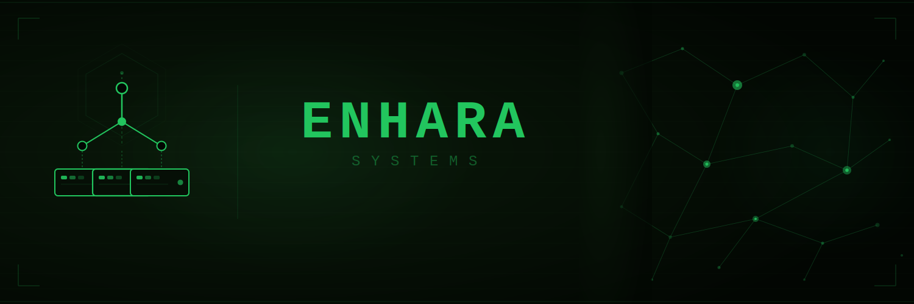

```yaml
focus: Full-Stack IT · Development · Infrastructure · Cloud & DevOps

hardware:
  repair:     Laptop · Desktop · Mobile · Peripherals
  deployment: Device · OS · Application

systems:
  platforms:  Windows · Linux · macOS
  admin:      User & access management · Network configuration

languages:
  scripting:   Multi-language · Cross-platform automation
  development: Systems · Web · Application

infrastructure:
  containers: Container orchestration & workload scheduling
  cloud:      Cloud platform engineering & operations
  iac:        Infrastructure & configuration as code
  on-prem:    On-premises virtualisation & private infrastructure

observability: Metrics · Dashboarding · Alerting · Log aggregation & analysis

delivery: Automated build, test & deployment

practices:
  workflow:    GitOps · Security-first
  reliability: Reliability engineering · Incident management
  governance:  WCAG 2.2 · ISO 27001 · ISO 9001
```

<div align="center">


</div>

<p align="center"><em>From bare metal to the cloud — hardware, systems, and infrastructure end to end.</em></p>
